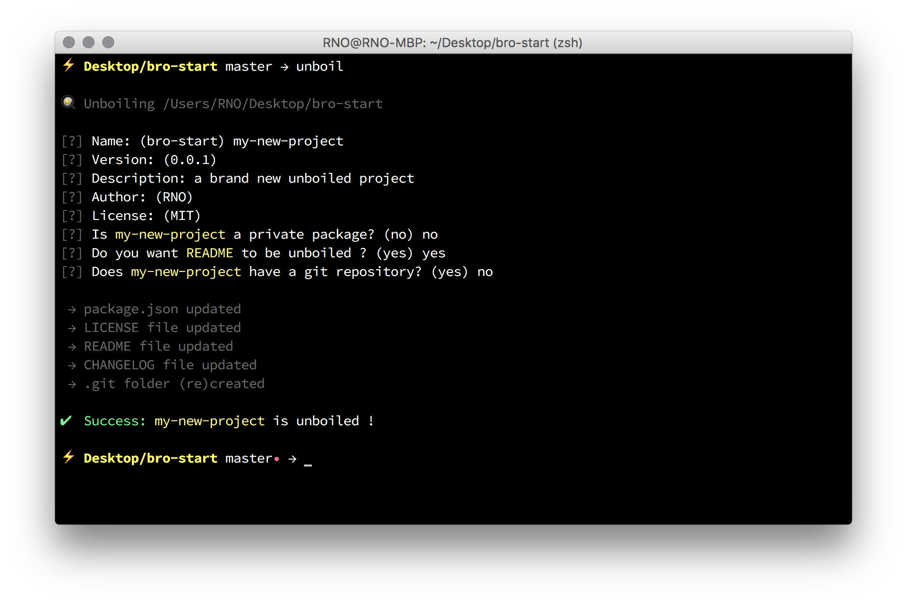

<p align="center">
  
</p>

<h1 align="center">unboil</h1>
<h3 align="center">Boilerplate customiser for lazy people</h3>
<div align="center">
  <!-- License -->
  <a href="https://raw.githubusercontent.com/brocessing/ghp/master/LICENSE">
    
  </a>
  <!-- Standard -->
  <a href="http://standardjs.com/">
    
  </a>
  <!-- npm version -->
  <a href="https://www.npmjs.com/package/unboil">
    
  </a>
</div>

<br>
<br>
<br>

## Features
- Update existing `package.json`
- Update existing `README`, create it if none
- Update existing `LICENSE`, create it if none
- Update or clear existing `.git`
- Support for `README` template
- Support for `LICENSE` template

## Installation
```sh
$ npm install -g unboil
```

## Usage
```sh
$ cd my-project
$ unboil
```

## License
[MIT](https://tldrlegal.com/license/mit-license).
